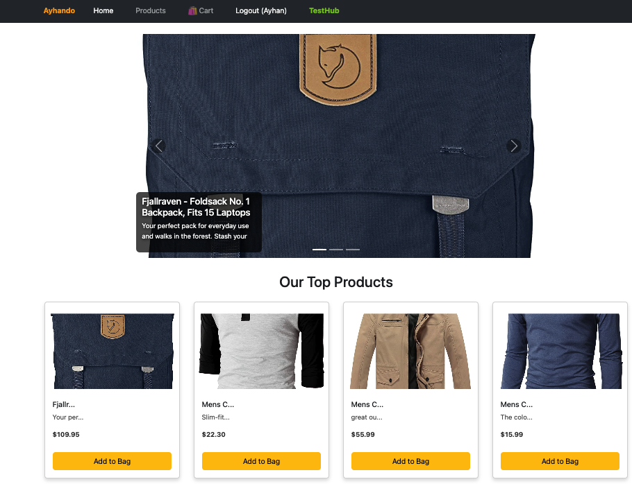

# Working with React



## Purpose of the Project:

To understand the general structure of React Router Dom, learn how to work with Private Route and working with Context API.

## Live Demo:

```
https://ayhando-ecommerce.vercel.app/
```

## Project Setup

```
npm i
```

## To Run the Project:

```
npm run dev
```

## To Open the Project in a Browser:

```
http://localhost:3000
```

- [x] Installation of React-Router-Dom and Bootstrap
- [x] Creation of Navbar
- [x] Construction of Page Structure
- [x] Accessibility to Pages via React Router Dom
- [x] Creation of Products Section
- [x] Home Page Development
- [x] Development of the Product Detail Page
- [x] Implementing Add to Cart Functionality
- [x] Cart Page Development
- [x] Development of Login and Register Pages
- [x] Implementation of User Authentication with Firebase
- [x] Private Route Implementation
- [x] Implementation of User Profile Page
- [x] Order Completion Process
- [x] Working with Context API
- [x] Finalizing the Project

